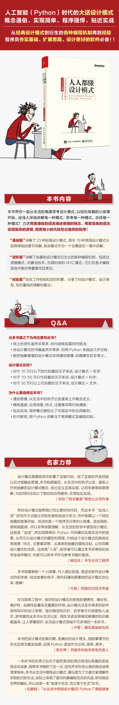

# Description of PyDesignPattern

## English
This is the source ocde of [ *Everybody Know Design Patterns : How to comprehend Design Patterns from daily life* ](https://gitbook.cn/gitchat/column/5b26040ac81ac568fcf64ea3).

## 中文
这是《人人都懂设计模式：从生活中领悟设计模式（Python实现）》一书的源码。可通过线上课程[如何从生活中领悟设计模式（Python）](https://gitbook.cn/gitchat/column/5b26040ac81ac568fcf64ea3) 进行试读。

设计模式(Design pattern)是一套被反复使用、多数人知晓的、无数工程师实践的代码设计经验的总结，它是面向对象思想的高度提炼和模板化。使用设计模式将会使你的代码具有更高的可重用性，更好的灵活性和可拓展性，更易被人阅读和理解。

程序不应只是冷冰冰的代码，更应赋予它生活的乐趣和特殊的意义。本课程将会从生活的角度，在生活的每一个细节和故事中解读一个个设计模式。 **力求用最通俗的语言阐述最难懂的概念；用最简单的语法实现最复杂的逻辑；用最短小的代码写出最强悍的程序！** 希望能给您带来一种全新的阅读体验和思考方式。

此升级版的系列分三部分内容：(1). 基础篇，19种常用设计模式单独章节讲解 + 剩余4种模式合集(会有1到2篇的篇幅)；(2). 进阶篇，是基础设计模式的衍生，也是各大编程语言中非常重要而常见的种编程机制；(3). 经验篇，将会分享我对设计原则、设计模式、项目重构的经验和看法。

## 书籍
[京东购买](https://item.jd.com/12580392.html)、[当当购买](http://product.dangdang.com/27848931.html)

## 线上课程

### 引导篇
[生活中的设计模式——启程之前，请不要错过我【试读】](http://gitbook.cn/gitchat/column/5a1c24de28554541fbc8f2e8/topic/5a1f8857211fa435d2b9ca6c)

### 基础篇

[生活中的监听模式——一坑爹的热水器](http://gitbook.cn/gitchat/column/5b26040ac81ac568fcf64ea3/topic/5b2604a8c81ac568fcf64ef1)
pattern/Observer.py

[生活中的适配模式——身高不够鞋来凑](http://gitbook.cn/gitchat/column/5b26040ac81ac568fcf64ea3/topic/5b26052ec81ac568fcf64f20)
pattern/Adapter.py

[生活中的状态模式——人有少、壮、老， 水之冰、液、汽](http://gitbook.cn/gitchat/column/5b26040ac81ac568fcf64ea3#catalog)
pattern/State.py

[生活中的单例模式——你是我生命的唯一](http://gitbook.cn/gitchat/column/5b26040ac81ac568fcf64ea3#catalog)
pattern/Singleton.py

[生活中的职责模式——我的假条去哪了](http://gitbook.cn/gitchat/column/5b26040ac81ac568fcf64ea3#catalog)
pattern/Responsibility.py

[生活中的中介模式——找房子问中介](http://gitbook.cn/gitchat/column/5b26040ac81ac568fcf64ea3#catalog)
pattern/Mediator.py

[生活中的代理模式——帮我拿一下快递](http://gitbook.cn/gitchat/column/5b26040ac81ac568fcf64ea3#catalog)
pattern/Proxy.py

[生活中的装饰模式——你想怎么穿就怎么穿](http://gitbook.cn/gitchat/column/5b26040ac81ac568fcf64ea3#catalog)
pattern/Decorator.py

[生活中的工厂模式——你要拿铁还是摩卡](http://gitbook.cn/gitchat/column/5b26040ac81ac568fcf64ea3#catalog)
pattern/SimpleFactory.py

[生活中的迭代模式——下一个就是你了](http://gitbook.cn/gitchat/column/5b26040ac81ac568fcf64ea3#catalog)
pattern/Iterator.py

[生活中的组合模式——自己电脑组装，价格再降三折](http://gitbook.cn/gitchat/column/5b26040ac81ac568fcf64ea3#catalog)
pattern/Composite.py

[生活中的构建模式——你想要一辆车还是一座房](http://gitbook.cn/gitchat/column/5b26040ac81ac568fcf64ea3#catalog) 
pattern/Builder.py

[生活中的克隆模式——给你一个分身术](http://gitbook.cn/gitchat/column/5b26040ac81ac568fcf64ea3#catalog)
pattern/Clone.py

[生活中的策略模式——怎么来不重要，人到就行](http://gitbook.cn/gitchat/column/5b26040ac81ac568fcf64ea3#catalog)
pattern/Strategy.py

[生活中的命令模式——大闸蟹，走起！](http://gitbook.cn/gitchat/column/5b26040ac81ac568fcf64ea3#catalog)
pattern/Command.py

[生活中的备忘模式——好记性不如烂笔头](http://gitbook.cn/gitchat/column/5b26040ac81ac568fcf64ea3#catalog)
pattern/Memento.py

[生活中的享元模式——颜料很贵必须充分利用](http://gitbook.cn/gitchat/column/5b26040ac81ac568fcf64ea3#catalog)
pattern/Flyweight.py

[生活中的外观模式——学妹别慌，学长帮你](http://gitbook.cn/gitchat/column/5b26040ac81ac568fcf64ea3#catalog)
pattern/Facade.py

[生活中的访问模式——一千个读者一千个哈姆雷特](http://gitbook.cn/gitchat/column/5b26040ac81ac568fcf64ea3#catalog)
pattern/Visitor.py

[生活中的设计模式——与经典23种设计模式的不解渊源](http://gitbook.cn/gitchat/column/5b26040ac81ac568fcf64ea3#catalog)

[生活中的设计模式——那些未完待续的设计模式](http://gitbook.cn/gitchat/column/5b26040ac81ac568fcf64ea3#catalog)
pattern/Template.py

### 进阶篇
[深入解读过滤器模式——制作一杯鲜纯细腻的豆浆](http://gitbook.cn/gitchat/column/5b26040ac81ac568fcf64ea3#catalog)
advanced_pattern/Filter.py

[深入解读对象池技术——共享让生活更便捷](http://gitbook.cn/gitchat/column/5b26040ac81ac568fcf64ea3#catalog)
advanced_pattern/ObjectPool.py

[深入解读回调机制——把你技能亮出来](http://gitbook.cn/gitchat/column/5b26040ac81ac568fcf64ea3#catalog)
advanced_pattern/Callback.py

### 经验篇
[谈谈我对设计模式的理解](http://gitbook.cn/gitchat/column/5b26040ac81ac568fcf64ea3#catalog)

[谈谈我对设计原则的思考](http://gitbook.cn/gitchat/column/5b26040ac81ac568fcf64ea3#catalog)

[谈谈我对项目重构的看法](http://gitbook.cn/gitchat/column/5b26040ac81ac568fcf64ea3#catalog)
